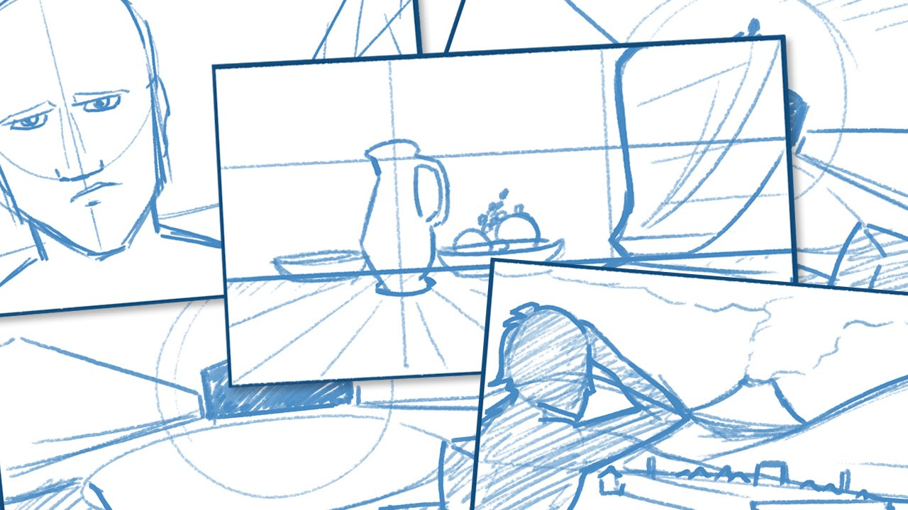

# Graphic Design Theory: Drawing 101 - Learn to Draw

##Course Syllabus

Instructor: Adrian Cunanan

Office Hours: Tuesdays, 8:00 PM - 9:00 PM ET, and by appointment

Office Location: [office.designyear.com](http://office.designyear.com)

Email Address: [adrian@designyear.com](mailto:%20adrian@designyear.com)

### Course Description

> Drawing is the foundational skill of all graphic design. Learning to solve design problems with a pencil is the training we need to be able solve problems most effectively with the digital approximation tools of in the palettes of our favorite design applications. But some designers get by without drawing...
>
> All the elements of design are rooted in drawing, as is painting. Drawing is the fundamental skill of visual artists of any stripe. The better we draw, the better we paint, and the better we design, because drawing contains all the problems and pitfalls we must overcome as designers. If we never fully deal with the problems with a pencil, we never fully solve our graphic design issues with much cruder tools. 
>
>-["Why graphic designers should learn to draw" by Douglas Bonneville](http://bonfx.com/why-graphic-designers-should-learn-to-draw/)

Drawing is the foundation of great design.  Putting pen to paper is the first step in the realization of any idea!  We will start our journey with learning to draw.

You will learn to:

- Learn proper methods to draw
- Give and receive constructive critiques
- Use group resources to work collaboratively and to iterate extensively

Simply stated, then, my goal in Drawing 101 is to help you better communicate and solve problems through drawing.

Drawing is an acquired skill, not a talent--anyone can learn to draw. All you need is a pencil, a piece of paper, and the willingness to tap into your hidden artistic abilities.

### Course Goals

Drawing 101, you will have the opportunity to:

1. Complete 30 drawing lessons;
2. reflect on your own processes of drawing;
3. set appropriate goals for improving your drawing skills and devise effective plans for achieving those goals;
4. contribute your voice to critical conversations already in progress;
5. learn how to give and take constructive critique of writing in progress;
6. collaborate with peers to define revision strategies for particular drawing pieces;
7. focus on revision as a creative and intellectual process.

### Texts (available at Amazon.com)

1. You Can Draw in 30 Days: The Fun, Easy Way to Learn to Draw in One Month or Less by Mark Kistler

### Course Policies

You will get what you give to this course.

Attendance and Participation: You will get what you give to this course.

Late Work: You will get what you give to this course.

Polished Work: You will get what you give to this course.

Evaluation: TBD

### A Note on Plagiarism

When you cheat in this course, you are just cheating yourself out of an opportunity to learn and grow as a designer.

If you are going to steal then steal like an artist ;-)

### Finally

Finally, I look forward to working with you this semester. Don’t hesitate to let me know if you have questions—that’s often the only way I know that I need to be more clear. Please see me or email me if you require special accommodations due to learning disabilities, religious practices, physical requirements, medical needs, or any other reasons.

> The roots of education are bitter, but the fruit is sweet. Quality is not an act, it is a habit. It is the mark of an educated mind to be able to entertain a thought without accepting it. 
>
>–Aristotle

## Schedule of Drawing Assignments
### Drawing 101, Adrian Cunanan, Instructor
#### *All readings are found in "You Can Draw in 30 Days" unless otherwise indicated.*

#### Week 1

 - Day 1 (Monday)
  - Lesson 1: The Sphere
 - Day 2 (Tuesday)
  - Lesson 2: Overlapping Spheres
  - *Office Hours with Adrian*
 - Day 3 (Wednesday)
  - Lesson 3: Advanced-Level Spheres
 - Day 4 (Thursday)
  - Lesson 4: The Cube
 - Day 5 (Friday)
  - Lesson 5: Hollow Cubes
 - Day 6 (Saturday)
  - Lesson 6: Stacking Tables
  - Show & Tell Project - Compile work from the week into presentation for critique.  Be ready to explain your process!
 - Day 7 (Sunday)
  - Lesson 7: Advanced-Level Cubes
  - Extra Credit: TBD

#### Week 2

 - Day 8 (Monday)
  - Lesson 8: Cool Koalas
  - Show & Tell Presentation
 - Day 9 (Tuesday)
  - Lesson 9: The Rose
  - *Office Hours with Adrian*
 - Day 10 (Wednesday)
  - Lesson 10: The Cylinder
 - Day 11 (Thursday)
  - Lesson 11: Advanced-Level Cylinders
 - Day 12 (Friday)
  - Lesson 12: Constructing with Cubes
 - Day 13 (Saturday)
  - Lesson 13: Advanced-Level Houses
  - Show & Tell Project - Compile work from the week into presentation for critique.  Be ready to explain your process!
 - Day 14 (Sunday)
  - Lesson 14: The Lily
  - Extra Credit: TBD

#### Week 3

 - Day 15 (Monday)
  - Lesson 15: Contour Tubes
  - Show & Tell Presentation
 - Day 16 (Tuesday)
  - Lesson 16: The Wave
  - *Office Hours with Adrian*
 - Day 17 (Wednesday)
  - Lesson 17: Rippling Flags
 - Day 18 (Thursday)
  - Lesson 18: The Scroll
 - Day 19 (Friday)
  - Lesson 19: Pyramids
 - Day 20 (Saturday)
  - Lesson 20: Volcanoes, Craters, and a Cup of Coffee
  - Show & Tell Project - Compile work from the week into presentation for critique.  Be ready to explain your process!
 - Day 21 (Sunday)
  - Lesson 21: Trees
  - Extra Credit: TBD

#### Week 4

 - Day 22 (Monday)
  - Lesson 22: A Room in One-Point Perspective
  - Show & Tell Presentation
 - Day 23 (Tuesday)
  - Lesson 23: A City in One-Point Perspective
  - *Office Hours with Adrian*
 - Day 24 (Wednesday)
  - Lesson 24: A Tower in Two-Point Perspective
 - Day 25 (Thursday)
  - Lesson 25: A Castle in Two-Point Perspective
 - Day 26 (Friday)
  - Lesson 26: A City in Two-Point Perspective
 - Day 27 (Saturday)
  - Lesson 27: Lettering in Two-Point Perspective
  - Show & Tell Project - Compile work from the week into presentation for critique.  Be ready to explain your process!
 - Day 28 (Sunday)
  - Lesson 28: The Human Face
  - Extra Credit: TBD

#### Week 5

 - Day 29 (Monday)
  - Lesson 29: The Human Eye of Inspiration
  - Show & Tell Presentation
 - Day 30 (Tuesday)
  - Lesson 30: Your Hand of Creativity
  - *Office Hours with Adrian*
 - Day 31 (Wednesday)
  - Retrospective